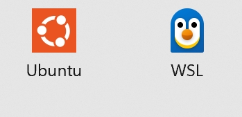
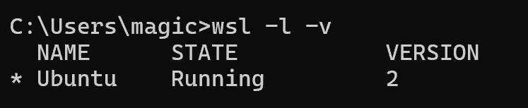
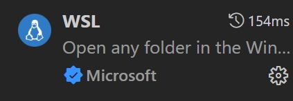

### Win11 wsl+VSCode配置
#### 安装wsl
在`win10`或`win11`中可以在powershell中快速安装wsl
```powershell
wsl --install
```
接下来打开开始界面新出现的Ubuntu

</div>

然后正常跟随Ubuntu的指示输入用户名以及密码等

可以在powershell中通过`wsl -l -v`检查是否安装成功

</div>

#### VSCode wsl配置
需要安装wsl插件

</div>

并点击左下角绿色位置（和ssh一致）实现连接

#### C/C++环境配置
(以下操作均在Ubuntu等wsl终端中进行)
安装gcc/g++编译器
```bash
sudo apt update
sudo apt install build-essential -y
```
使用以下命令确认安装成功
```bash
gcc --version
g++ --version
```
安装gdb调试工具
```bash
sudo apt install gdb -y
```

接下来在VSCode中创建cpp程序，在左侧栏中选择Run and debug,选择g++,就可以正常运行和调试程序啦（task.json,launch.json会自动配置完毕）